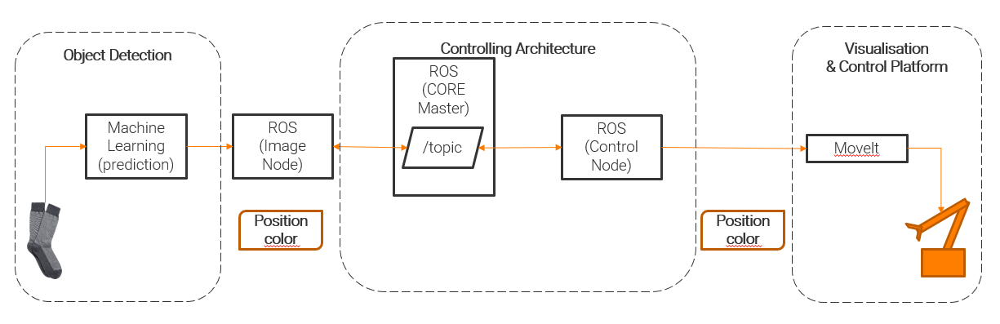
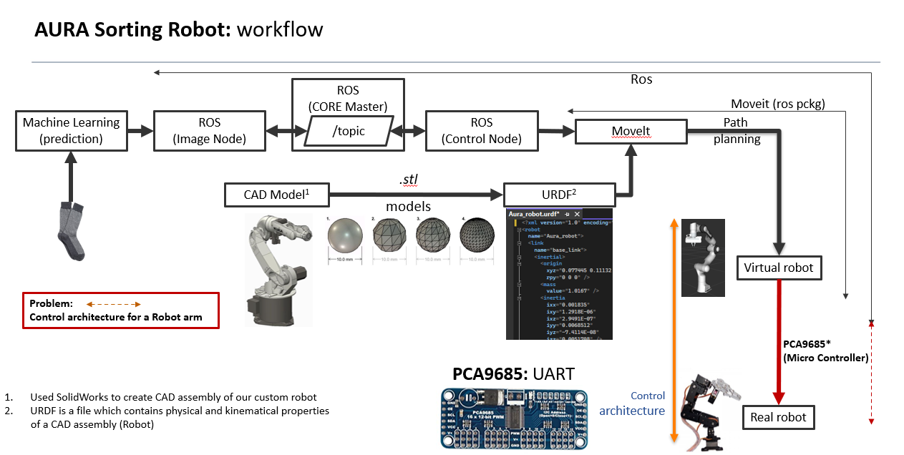
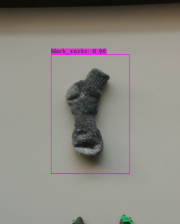
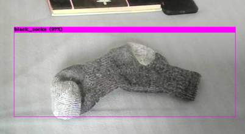
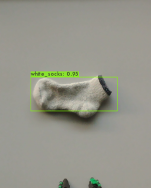

# Robot-Arm-for-Sorting-Mechanism-using-ROS-and-YOLOv4


<!--  -->

This Project is to have a Robot Arm to do sorting mechanisms for things using darknet with addition of Digital Twins

Idea: Sorting socks by its color using robot arm from conveyor system
Software Tools:
1. YOLOv4 Neural Networks model - Prediction of socks color 
2. ROS (Robotics Operating System) - Controlling robot arm and other apperatus
3. MoveIt tool - For path planning and Kinematical definitions & Visualisation


# Contents:
  <!-- 1. CAD Models of custom robot
  2. ROS installation
  3. MoveIt implementation
  4. Machine Learning Model for Prediction of color of socks
  5. Inferencing ML model on JetSon nano throgh ROS
  6. Hardware Architecture for Robot
  7. Controlling the Actual robot
  8. Visualization of robot as Digital Twin -->
  1. Introduction
  2. Requirements for Raspbeery pi (Controlling robot)
  3. Requirements for Ros Master PC (Path Planning)
  4. Requirements for ML work stations (prediction of socks yolov4 model) for RTX3060
  5. Our own custom Dataset
  6. Procedures for building up Yolo Architecture
  7. Procedures for building up Moveit architecture
  8. Procedures for robot raspbeery pi
  9. Demo

# Process plan


## 1. Introduction
Sorting is huge task in as well as in homes and industries this project is about making an opensource diy socks sorting robot where it can predict the color of socks
either black and white and grab it using opencv and does requried path planning using "Moveit"- a ros noetic plugin. and place it in the correct box.
The Entire Architecture of would be explained in this image below:




## 2. Requirements for Raspbeery pi (Controlling robot)
- Bare (Flashed) Ubuntu OS on Raspberry pi 3/4 (terminal version)
- Ros noetic for raspberry: [link](https://varhowto.com/install-ros-noetic-raspberry-pi-4/#Before_installing_ROS_Noetic_on_your_Raspberry_Pi)
- Required dependencies for running PCA9685: [link](https://github.com/adafruit/Adafruit_Python_PCA9685)
- sanity check using builit server-receiver nodes
- Perfect wiring of hardwares


After this please make the asssembly of diy robot from "Joy-It" link: https://joy-it.net/en/products/Robot02

## 3. Requirements for Ros Master PC (Path Planning)
- newly flashed ubuntu 20.04 (with GUI version)
- For ROS: [Noetic/Installation/Ubuntu - ROS Wiki](http://wiki.ros.org/noetic/Installation/Ubuntu)
- For Moveit: [MoveIt Tutorials - Installation](https://ros-planning.github.io/moveit_tutorials/index.html)
- sanity check using builit server-receiver nodes

## 4. Requirements for ML work stations (prediction of socks yolov4 model) for RTX3060
- Cmake>=3.18
- opencv
- NvidiaGPU Drivers 470.42.01
- cuda version 11.4
- nvcc 
- yolov4 architecture

## 5. Our own custom Dataset
https://www.kaggle.com/datasets/harigovindasamy/socks-color-dataset-white-and-black

## 6. Procedures for building up Yolo Architecture:
1. Disable "Secure - Boot" by the command: [source](https://wiki.ubuntu.com/UEFI/SecureBoot/DKMS)
	```sudo mokutil --disable-validation```
	- Check your secure boot status (Enabled/Disabled) through this command: `mokutil --sb-state` which need this lib: `sudo apt-get install mokutil`
  - Check all the prerequiremens process from the [nividia recommended page](https://docs.nvidia.com/cuda/cuda-installation-guide-linux/index.html)
2. GUI-Version: Downalod and install from ubuntu store cmake>=3.18
  - Inbuild Version>18.0: [Follow this link](https://unixcop.com/install-cmake-on-ubuntu-20-04-lts-21-04/)
3. make sure of installation of right opencv, drivers, cuda, nvcc
4. pull updated version of yolov4 from: https://github.com/AlexeyAB
5. copy our custom pretrained models from our folder "scripts/socks_model/Robot" to yolo directory
6. Build using the make file for further information about building visit: https://github.com/AlexeyAB
7. copy the required scripts "scripts/for_ml_inference" to the workstation

Our socks prediction model is ready now. so we can move to Ros master path planning 

## 7. Procedures for building up Moveit architecture:
1. first run this:
```
# For enabling each type:
sudo add-apt-repository universe
sudo add-apt-repository multiverse
sudo add-apt-repository restricted
```
1. copy our "urdf_and_mesh_models_for_moveit" to ROS master PC to ubuntu ROS workspace eg: "home/username/catkin_workspace/src/"
2. run `roslaunch moveit_setup_assistance setup_assistance.launch`
3. then select the urdf file from "urdf_and_mesh_models_for_moveit/Aura_robot/urdf/Aura_robot.urdf", the meshes will be loaded and robot will be visible on right side
4. build the moveit architecutre (naming convection should be neat and constant for whole process)
5. copy requred codes from "Robot-Arm-for-Sorting-Mechanism-using-ROS-and-YOLOv4\scripts\for_master" to catkin workspace then build it

The Workflow of how moveit works from urdf is explained here:


## 8. Procedures for robot raspbeery pi:
1. sanity check of all dependencies installed aready for the PCA9685 hardwares and electrical connections
2. copy "Robot-Arm-for-Sorting-Mechanism-using-ROS-and-YOLOv4\scripts\robot_pi" to raspberry pi

## 9. Demo
#### Connecting two ROS systems:
```
#ip of master: 192.168.0.136
#ip of pi: 192.168.0.162

in Master:
export ROS_MASTER_URI=http://192.168.0.136:11311
export ROS_IP=192.168.0.136

inslave:
export ROS_MASTER_URI=http://192.168.0.136:11311
export ROS_IP=192.168.0.162

#Cheking if connection sucessful:
on master: 
	rosrun rospy_tutorials talker.py
	output: <some msg>
on slave:
	rosrun rospy_tutorials listener.py
	output: <received msg>
```
#### ADD THESE LINES IN .BASHRC for all the pc's and pi's
```py
## Custom added
source /opt/ros/noetic/setup.bash
source ~/catkin_tutorials/devel/setup.bash
export ROS_WORKSPACE=~/catkin_tutorials

#connecting device to the ros
export ROS_MASTER_URI=http://192.168.0.136:11311
export ROS_IP=192.168.0.162
```

Starting the process:

#### Sample Run:
1. Register all ros devices in new wifi: (use 'sudo nano ~/.bashrc')
[ADD THESE LINES IN .BASHRC] 

on master:
1. run roscore
2. run <roslaunch CDL_Robot_compiled demo.launch>

on slave:
	1. <rosrun beginner_tutorials watcher.py>
	
## Working Video
"https://www.youtube.com/embed/zcNAyf5Y-F0"

The output of the image/camera feed would be like this:


	



